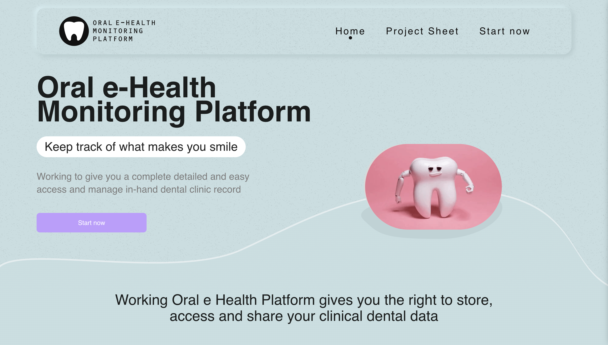

# Bioinformatician / Data Scientist
[🕴🏼 LinkedIn](https://www.linkedin.com/in/eduardojmesteves/) | [📧 Email](mailto:eduardojmestves@gmail.com)

Aveiro, Portugal 🇵🇹 | Chelmsford, England 🏴󠁧󠁢󠁥󠁮󠁧󠁿

---

### Technical Skills

| **Programming**                 | Python, R, Julia, Bash/Shell scripting                               |
| **Data Analysis**               | Genomic and proteomic data processing                                |
| **Statistics & Machine Learning**| Biostatistics, scikit-learn, PyTorch, Bioconductor                  |
| **Visualization**               | Matplotlib, ggplot2, Seaborn, Cytoscape                              |
| **Database Management**         | SQL, PostgreSQL                                                      |
| **Cloud & Containers**          | Google Cloud, Docker                                                 |
| **Version Control**             | Git, GitHub, GitLab                                                  |
| **Operating Systems**           | Linux, UNIX                                                          |
| **Proteomics**                  | Protein quantitation, identification (MS), purification (HPLC/FPLC)  |
| **Genomics**                    | DNA isolation, PCR, RT-PCR, sequence alignment, NGS analysis         |
| **Interactomics**               | Host-pathogen interactions, Cytoscape, GO enrichment                 |
| **Network & Pathway Analysis**  | Gene regulatory networks, KEGG, Reactome                             |

---

### **Projects**

#### Oral e-Health Monitoring Platform 🦷🩺
Developed in Django (backend) and Vue (frontend).
Project funded by CENTRO2020 and the European Regional Development Fund (ERDF), this platform will allow patients to access their oral health history, including diagnoses and treatments carried out, in a clear and objective way. This record can be shared with the new dentist, contributing to correct clinical decision making.

[Project Home page](https://teethwallet.com/) | [Project on the media](https://fmd.viseu.ucp.pt/pt-pt/noticias/plataforma-oehmp-para-diagnostico-diferenciado-e-tratamentos-inovadores-9346)

---

### EXPERIENCE
**Data Scientist, Prana-Tech, Ltd**  
*September 2023 - Present*
- Developed machine learning models for predicting health outcomes, with a focus on handling and analyzing high-dimensional biological data.
- Conducted feasibility assessments of bioinformatics approaches, optimizing model selection based on data characteristics.
- Designed and implemented visualization tools for complex bioinformatics datasets, improving interpretability and user experience.
- Managed health questionnaires and genomic data analysis, converting raw bioinformatics data into actionable insights for clinical applications.
- Collaborated with cross-functional teams to integrate bioinformatics models into healthcare applications, ensuring usability and functionality.

**PhD Research Fellow, Catholic University of Portugal**  
*September 2018 - August 2021*

- Led the development of innovative diagnostic strategies, including the bioinformatics analysis of proteomics data for COVID-19 detection in saliva.
- Conducted extensive MS proteomics research, utilizing bioinformatics tools to identify host protein responses to SARS-CoV-2.
- Served as the principal investigator for the CoVTec in Saliva project, applying bioinformatics to develop saliva-based COVID-19 tests.
- Developed and maintained custom bioinformatics software for the analysis and visualization of clinical data, using Python, R, HTML, and JavaScript.

**Project Manager / Junior Software Developer, PromptEquation, Lda**  
*September 2021 - Present*

- Onboarded and managed multiple bioinformatics projects, leveraging analytical skills to assess and fulfill complex project requirements.
- Applied data analysis techniques, including database queries and BI tools, to generate detailed reports for bioinformatics research.
- Developed Python scripts and tools for bioinformatics data analysis and reporting, optimizing performance and accuracy.

**MsC Research Fellow, Catholic University of Portugal**  
*September 2015 - August 2018*

- Developed SOPs for bioinformatics-driven analyte testing, ensuring the integrity of biospecimens and accuracy of data analysis.
- Provided bioinformatics support for software application design, testing, and development, particularly in genomic data processing.
- Utilized R scripts to analyze and visualize bioinformatics data, enhancing data interpretation and presentation in research findings.

---
### **Publications**

- [Esteves E, Mendes VM, Manadas B, et al. COVID-19 Salivary Protein Profile: Unravelling Molecular Aspects of SARS-CoV-2 Infection. J Clin Med. 2022;11(19):5571. Published 2022 Sep 22. doi:10.3390/jcm11195571](https://pubmed.ncbi.nlm.nih.gov/36233441/)

- [Esteves E, Mendes AK, Barros M, et al. Population wide testing pooling strategy for SARS-CoV-2 detection using saliva. PLoS One. 2022;17(1):e0263033. Published 2022 Jan 28. doi:10.1371/journal.pone.0263033](https://www.ncbi.nlm.nih.gov/pmc/articles/PMC8797214/)

- [Martins JE, D’Alimonte D, Simões J, Sousa S, Esteves E, Rosa N, Correia MJ, Simões M, Barros M. MODeLING.Vis: A Graphical User Interface Toolbox Developed for Machine Learning and Pattern Recognition of Biomolecular Data. Symmetry. 2023; 15(1):42. https://doi.org/10.3390/sym15010042](https://www.mdpi.com/2073-8994/15/1/42)

- [Esteves E, Rosa N, Correia MJ, Arrais JP, Barros M. New Targets for Zika Virus Determined by Human-Viral Interactomic: A Bioinformatics Approach. Biomed Res Int. 2017;2017:1734151. doi:10.1155/2017/1734151](https://pubmed.ncbi.nlm.nih.gov/29379794/)

---

### **Talks & Lectures**

- **Biomolecular Laboratories II** -  Assistant Lecturer, Catholic University of Portugal, September 2020 - August 2021

- **Molecular Biology** - Assistant Lecturer, Catholic University of Portugal, September 2020 - August 2021

- **Seminars Projects** - Assistant Lecturer, Catholic University of Portugal, September 2020 - August 2021
 
---

### **Education**

**PhD in Biomedicine**  
*University of Beira Interior, September 2018 - July 2023*

**MsC in Cell and Molecular Biology**  
*University of Aveiro, September 2012 - December 2014*

**BsC in Biomedical Sciences**  
*Catholic University of Portugal, September 2009 - July 2012*

---

### **Advanced Courses**

#### 2024 - Bioinformatics for P2x Single-cell Genomics
- **Focus**: Single-cell analysis, wet lab techniques, data analysis in Python and R.
- **Skills**: Single-cell RNA sequencing, data visualization, bioinformatics pipeline development, Python and R programming.
- **Certificate**: [Bioinformatics for P2x Single-cell Genomics](https://www.p2xcost.eu/who-are-we/)

#### 2024 - Statistical Learning with Python
- **Focus**: Supervised learning, regression, classification, tree-based methods.
- **Skills**: Ridge/Lasso, splines, SVMs, neural networks, PCA, clustering.
- **Certificate**: [Statistical Learning with Python](https://www.edx.org/learn/python/stanford-university-statistical-learning-with-python)

#### 2022 - Data Science
- **Focus**: Data preparation, machine learning, and deep learning.
- **Skills**: Model evaluation, comparison, Industry 4.0 applications.
- **Certificate**: [Data Science](https://www.unave.pt/wp-content/uploads/2021/10/folheto_DataScience.pdf)

#### 2019 - Data Analysis Using R
- **Focus**: Data analysis in R.
- **Skills**: Data manipulation, visualization, using R libraries.
- **Certificate**: [Data Analysis Using R](https://www.ua.pt/en/news/8/83028)

#### 2019 - Experimental Design and Analysis of Multivariate Data
- **Focus**: Multivariate data analysis and experimental design.
- **Skills**: Clustering, hypothesis testing, using PRIMER v6 and PERMANOVA+.
- **Certificate**: [Experimental Design and Analysis of Multivariate Data](https://www.ua.pt/file/63125)

#### 2018 - Computational Biology
- **Focus**: Computational biology for biologists and exact scientists.
- **Skills**: Applied mathematics, physics for biology, mini-research projects.
- **Certificate**: [Computational Biology](https://www.uc.pt/en/events/computationalbiology/)

#### 2015 - Clinical Investigator Certification
- **Focus**: Standardizing clinical research training in Europe.
- **Skills**: Pharmaceutical medicine, clinical research infrastructure.
- **Certificate**: [CLIC Certificate](https://www.nms.unl.pt/en-us/education/programs/advanced-training/programa-clic-nivel-1-en-us)
