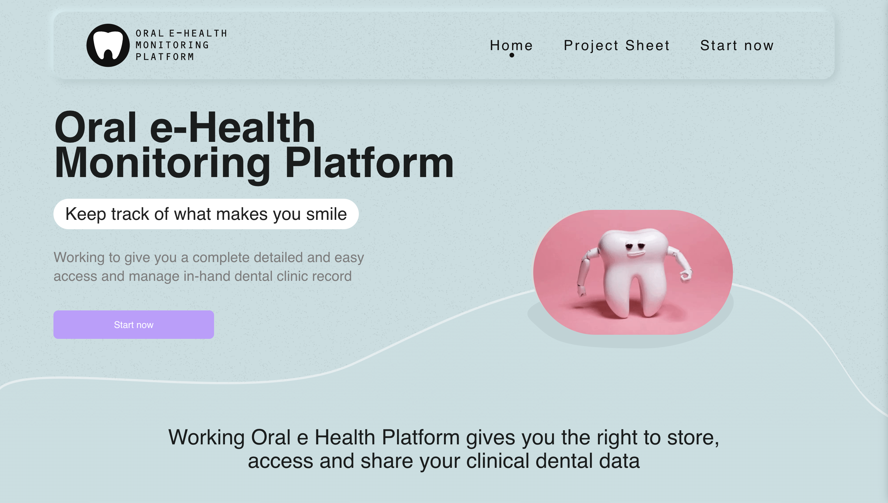

<noscript><iframe src="https://www.googletagmanager.com/ns.html?id=GTM-5F3F5L69"
height="0" width="0" style="display:none;visibility:hidden"></iframe></noscript>

## 🚀 Research Programme & Bioinformatics specialist

*Coordinate complex research programmes, and apply bioinformatics expertise to projects—bridging management and science.*

📍 UK/EU – open to remote

[👉 Let’s connect — schedule a chat](https://cal.com/eduardojmesteves/meetme)

---



---

### **EXPERIENCE**

**Senior Science Officer** - ELIXIR Europe\
*January 2025 - Present*

- Support the ELIXIR Compute and Data Platforms by delivering technical contributions to the ELIXIR Scientific Programme and externally funded projects.
- Coordinate multi-partner deliverables, risks and reporting across EOSC projects (ENTRUST, OSCARS, FIDELIS, STEERS).  
- Support development of **trusted research infrastructures** for sensitive health data; align ethics, security and interoperability.  
- Shape best practices for **FAIR data**, software sustainability, and open-science adoption across the ELIXIR network.  
- Contribute to grant proposals, impact frameworks and cross-programme integration.
- Facilitate Open Science, data reproducibility, and software reusability across European life sciences by engaging with ELIXIR Nodes and stakeholders.
- Conduct background research on emerging technologies, contribute to grant proposals, and provide scientific insights for ELIXIR’s research infrastructure.

**Bioinformatician / Data Scientist** - Prana-Tech, Ltd\
*September 2023 - December 2024*

- Developed machine learning models to predict health outcomes.
- Analysed health questionnaires and blood data to generate actionable insights.
- Evaluated the feasibility of modelling approaches optimised for health data characteristics.
- Integrated ML models into healthcare applications, ensuring functionality and usability.
- Designed and implemented visualisation dashboards to improve data interpretability.

**Project Manager / Junior Software Developer** - PromptEquation, Lda\
*September 2021 - December 2024*

- Managed 11 interdisciplinary projects through requirements analysis, budget optimisation and accurate documentation of customer requirements.
- Developed in the Odoo framework and adapted Python scripts to fetch data from the server.
- Developed and prepared different dashboards using open source tools (i.e. Apache Superset)
- Used BI tools and dashboards to produce detailed reports for decision making.
- Performed advanced database queries in PostgreSQL for data management and analysis.

**Research Associate** - Catholic University of Portugal\
*September 2015 - August 2021*

- Performed MS-based proteomic analysis to characterise protein responses to SARS-CoV-2.
- Performed advanced data analysis and visualisation using Python and R on genomic and proteomic datasets.
- Developed custom software to store, analyse and visualise clinical data from NGS and MS sources.
- Implemented COVID-19 saliva-based diagnostic protocols integrating genomic and proteomic data.

**Assistant Lecturer** - Catholic University of Portugal\
*September 2020 - August 2021*

- Supported undergraduate classes to develop **critical thinking and research skills**.  
- Led laboratory sessions that combined **hands-on experiments with computer-based bioinformatics learning**.  
- Delivered **results-oriented classes** with practical applications in proteomics and molecular biology.  
- Helped establish **industry–academia partnerships** to give students real-world project experience.  

| **Course** | **Role** | **Institution** | **Start** | **End** |
|---|---|---|---:|---:|
| Biomolecular Laboratories II | Assistant Lecturer | Catholic University of Portugal | Sep 2020 | Aug 2021 |
| Molecular Biology | Assistant Lecturer | Catholic University of Portugal | Sep 2020 | Aug 2021 |
| Seminars Projects | Assistant Lecturer | Catholic University of Portugal | Sep 2020 | Aug 2021 |

    <!-- Primary booking CTA near hero -->
    

    <a href="https://your-booking-link" class="pill"
        style="background:#0b5fff;color:#fff;border-color:#0b5fff;"
        target="_blank" rel="noopener noreferrer">
        📆 Book a strategy session →
    </a>
    

### Skills

| **Area** | **Skills & Tools** |
|---|---|
| **Programme & Project Management** | Multi-partner project coordination, deliverables/reporting, grant reporting, stakeholder alignment, Open Science/FAIR/TRE |
| **Bioinformatics & Life Sciences** | Proteomics (MS), NGS data integration, multi-omics pipelines, biomarker discovery, reproducibility (Snakemake, Nextflow basics), PRIDE/ProteomeXchange |
| **Data Science & Analytics** | Python (pandas, matplotlib, scikit-learn), R (tidyverse, ggplot2), SQL (PostgreSQL), Julia (introductory), statistics & QC, dashboards (Superset) |
| **Software & Infrastructure** | Odoo (Python), Docker, Git/GitHub, GCP basics, workflow automation, data validation scripts, metadata schemas |
| **Teaching & Communication** | University lecturing (lab & theory), mentoring BSc/MSc students, outreach & community building, cross-sector collaboration |
| **Languages** | Portuguese (native), English (advanced – IELTS B2+) |

<!-- Primary booking CTA near hero -->

  <a href="https://your-booking-link" class="pill"
     style="background:#0b5fff;color:#fff;border-color:#0b5fff;"
     target="_blank" rel="noopener noreferrer">
    📆 Book a strategy session →
  </a>

---

### **Projects**

#### 🔬 Research Projects

##### 🧬 COVID-19 Salivary Protein Profile

**Problem.** Characterise host response and identify dysregulated processes in COVID-19 using saliva proteomics.  
**Approach.** MS proteomics + PLS-DA, enrichment (FunRich), interactomics (OralInt).  
**Outcome.** Highlighted 5 dysregulated processes; uncovered 10 proteins not previously associated with SARS-CoV-2.  
**Link.** DOI: [10.3390/jcm11195571](https://doi.org/10.3390/jcm11195571)  

[Institution Project page](https://ciencia.ucp.pt/en/projects/covtec-em-saliva-diagn%C3%B3stico-da-covid-19-em-saliva)

[How Odoo helped creating a saliva tests platform in record time](https://www.erpgap.com/blog/odoogap-blog-1/covid-saliva-test-platform/)

---

##### 🧬 CoVTec in Saliva (Pooling Strategy)

**Problem.** Scale saliva testing efficiently in a regional network.  
**Approach.** Protocol development + platform for real-time data capture and role-based access; analytics in Python.  
**Outcome.** Validated pooling strategy and streamlined operations.  
**Link.** DOI: [10.1371/journal.pone.0263033](https://doi.org/10.1371/journal.pone.0263033)  

---

##### ⚙️ SalivaPRINT Toolkit

**Problem.** Need for a standardised resource to profile salivary proteomes across conditions.  
**Approach.** Built a reference dataset (PRIDE submissions) + software toolkit for feature extraction and biomarker discovery.  
**Outcome.** Provided reusable resource; enabled comparative salivary proteomics studies.  
**Link.** DOI: [doi:10.3390/jcm11195571](https://pubmed.ncbi.nlm.nih.gov/36233441/)

[GitHub Repository](https://github.com/salivatec/SalivaPRINT)

---

##### 🦷 Oral e-Health Monitoring Platform — *Co-Founder*

**Problem.** Lack of integrated tools for monitoring oral health data longitudinally, combining patient records, omics, and clinical observations.  
**Approach.** Co-founded the development of a platform to capture, store, and visualise oral health data in a reproducible and accessible way, aligning with FAIR principles.  
**Outcome.** Provided a foundation for digital oral health monitoring; contributed to ongoing research in oral disease progression and prevention.  

---

##### 🧬🦷 Oral Microbiome Profile in Clear Aligner Patients During Treatment

**Problem.** Limited knowledge of how orthodontic clear aligner therapy influences the oral microbiome composition.  
**Approach.** Collected saliva samples from patients undergoing aligner treatment; performed shotgun proteomics and 16S rRNA profiling with clinical metadata integration.  
**Outcome.** Identified temporal shifts in microbial communities and host–microbiome interactions during treatment, informing oral health monitoring and aligner therapy protocols.  
**Link.** DOI: [Oral Microbiota in Caries Prevention, Diagnosis and Management - Challenges and Opportunities](http://hdl.handle.net/10366/159627)

---

#### 🏭 Industry Projects

##### 📊 Prana-Tech (Health Data Modelling & Dashboards)

**Problem.** Clinicians lacked tools to evaluate patient data quality and compliance in real time.  
**Approach.** Designed dashboards (Superset/Metabase), integrated modelling feasibility studies on health questionnaires and blood data.  
**Outcome.** Shortened data-to-insight cycle; improved compliance monitoring and governance traceability.  

---

##### ⚙️ PromptEquation (ERP & Data Engineering)

**Problem.** SMEs needed custom ERP workflows and advanced reporting for operations.  
**Approach.** Python/Odoo development, PostgreSQL analytics, project management (requirements + budgets).  
**Outcome.** Delivered ERP modules and reproducible dashboards; reduced scope creep and improved reporting reliability.  

---

#### 💡 Hackathon & Innovation

##### 💡 Aveiro Tech City Hackathon 2024 — Challenge 2 (Bosch Portugal)

**Problem.** Industrial process confirmation in assembly lines and workstations is often unreliable in environments with poor internet connectivity. Bosch Portugal set the challenge of creating an autonomous and automatic system that could overcome these constraints.  
**Approach.** Designed and prototyped a solution using **Arduino Nano 33 BLE Sense sensors** for proximity and condition monitoring, paired with an **ESP32 watch** for communication and user interaction. Two deployment modes were created:  

  1. **Standalone mode** with only Arduino Nano 33 BLE Sense for lightweight confirmation.
  2. **Hybrid mode** combining Arduino + ESP32 for broader connectivity and user feedback.  
**Outcome.** Delivered a functional prototype during the Hackathon that demonstrated **low-cost IoT feasibility** for industrial process validation. The design was applicable across **gravity-based assembly lines, manual progression lines, and fixed workstations**.  
**Event.** [Aveiro Tech City Hackathon 2024](https://www.fct.unl.pt/noticias/agenda/2024/09/aveiro-tech-city-hackathon-2024) · [Bosch Portugal Challenge](https://www.it.pt/Events/Event/5652)  

<!-- Primary booking CTA near hero -->

  <a href="https://your-booking-link" class="pill"
     style="background:#0b5fff;color:#fff;border-color:#0b5fff;"
     target="_blank" rel="noopener noreferrer">
    📆 Book a strategy session →
  </a>

---

### **Education**

| **Degree** | **Institution** | **Dates** |
|---|---|---|
| **PhD, Biomedicine** | Universidade da Beira Interior | 2018 – 2023 |
| **MSc, Cell & Molecular Biology** | Universidade de Aveiro | 2012 – 2014 |
| **BSc, Biomedical Sciences** | Universidade Católica Portuguesa | 2009 – 2012 |

#### **Advanced Courses**

##### 2024 - Bioinformatics for P2x Single-cell Genomics

- **Focus**: Single-cell analysis, wet lab techniques, data analysis in Python and R.
- **Skills**: Single-cell RNA sequencing, data visualization, bioinformatics pipeline development, Python and R programming.
- **Certificate**: [Bioinformatics for P2x Single-cell Genomics](https://www.p2xcost.eu/who-are-we/)

##### 2024 - Statistical Learning with Python

- **Focus**: Supervised learning, regression, classification, tree-based methods.
- **Skills**: Ridge/Lasso, splines, SVMs, neural networks, PCA, clustering.
- **Certificate**: [Statistical Learning with Python](https://www.edx.org/learn/python/stanford-university-statistical-learning-with-python)

##### 2022 - Data Science

- **Focus**: Data preparation, machine learning, and deep learning.
- **Skills**: Model evaluation, comparison, Industry 4.0 applications.
- **Certificate**: [Data Science](https://www.unave.pt/wp-content/uploads/2021/10/folheto_DataScience.pdf)

##### 2019 - Data Analysis Using R

- **Focus**: Data analysis in R.
- **Skills**: Data manipulation, visualization, using R libraries.
- **Certificate**: [Data Analysis Using R](https://www.ua.pt/en/news/8/83028)

##### 2019 - Experimental Design and Analysis of Multivariate Data

- **Focus**: Multivariate data analysis and experimental design.
- **Skills**: Clustering, hypothesis testing, using PRIMER v6 and PERMANOVA+.
- **Certificate**: [Experimental Design and Analysis of Multivariate Data](https://www.ua.pt/file/63125)

##### 2018 - Computational Biology

- **Focus**: Computational biology for biologists and exact scientists.
- **Skills**: Applied mathematics, physics for biology, mini-research projects.
- **Certificate**: [Computational Biology](https://www.uc.pt/en/events/computationalbiology/)

##### 2015 - Clinical Investigator Certification

- **Focus**: Standardizing clinical research training in Europe.
- **Skills**: Pharmaceutical medicine, clinical research infrastructure.
- **Certificate**: [CLIC Certificate](https://www.nms.unl.pt/en-us/education/programs/advanced-training/programa-clic-nivel-1-en-us)

<!-- Primary booking CTA near hero -->

  <a href="https://your-booking-link" class="pill"
     style="background:#0b5fff;color:#fff;border-color:#0b5fff;"
     target="_blank" rel="noopener noreferrer">
    📆 Book a strategy session →
  </a>

---

### **Publications**

- [Esteves E, Mendes VM, Manadas B, et al. COVID-19 Salivary Protein Profile: Unravelling Molecular Aspects of SARS-CoV-2 Infection. J Clin Med. 2022;11(19):5571. Published 2022 Sep 22. doi:10.3390/jcm11195571](https://pubmed.ncbi.nlm.nih.gov/36233441/)

- [Esteves E, Mendes AK, Barros M, et al. Population wide testing pooling strategy for SARS-CoV-2 detection using saliva. PLoS One. 2022;17(1):e0263033. Published 2022 Jan 28. doi:10.1371/journal.pone.0263033](https://www.ncbi.nlm.nih.gov/pmc/articles/PMC8797214/)

- [Martins JE, D’Alimonte D, Simões J, Sousa S, Esteves E, Rosa N, Correia MJ, Simões M, Barros M. MODeLING.Vis: A Graphical User Interface Toolbox Developed for Machine Learning and Pattern Recognition of Biomolecular Data. Symmetry. 2023; 15(1):42. https://doi.org/10.3390/sym15010042](https://www.mdpi.com/2073-8994/15/1/42)

- [Cruz I, Esteves E, Fernandes M, et al. SalivaPRINT Toolkit - Protein profile evaluation and phenotype stratification. J Proteomics. 2018;171:81-86. doi:10.1016/j.jprot.2017.08.011](https://pubmed.ncbi.nlm.nih.gov/28843534/)

- [Esteves E, Rosa N, Correia MJ, Arrais JP, Barros M. New Targets for Zika Virus Determined by Human-Viral Interactomic: A Bioinformatics Approach. Biomed Res Int. 2017;2017:1734151. doi:10.1155/2017/1734151](https://pubmed.ncbi.nlm.nih.gov/29379794/)

--

### **Leadership & Community Engagement**

**Board Member (Direction) — 🏸 Beira-Mar Squash Club**  
*2022 – Present*  

- Coordinate organisation of tournaments and events, ensuring smooth logistics and volunteer management.  
- Promoted squash in the community through open days, school visits, and initiatives for young people to try the sport.  
- Collaborate with the [Portuguese Squash Federation](https://www.fsq.pt/) to explore new ways of improving visibility and participation nationally.  
- Oversee general management activities of the club, including budgeting, sponsorship, and facility coordination.  
